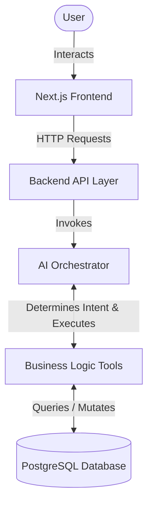
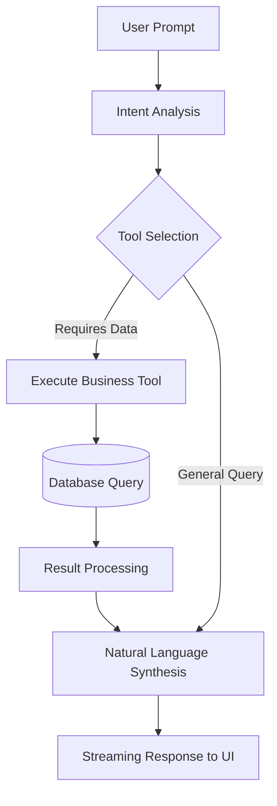

# OpsMind AI


**Live Demo:** [https://ops-mind-ai-sa1v.vercel.app/login](https://ops-mind-ai-sa1v.vercel.app/login)

## Project Overview

OpsMind AI is an AI-powered Enterprise Operations and Supply Chain Copilot. It bridges the gap between complex enterprise data systems and non-technical business users by combining a traditional operations dashboard with an intelligent AI assistant capable of interacting with ERP-style business data via natural language.

The application serves as a portfolio project demonstrating full-stack engineering capabilities, focusing on AI tool-calling architectures, role-based access control, and robust database design.

## Problem Statement

*   **Complexity of ERP Systems:** Traditional Enterprise Resource Planning (ERP) systems are difficult to navigate, requiring specialized training to extract basic operational metrics.
*   **Data Accessibility Constraints:** Business users (e.g., sales reps, warehouse managers) struggle to access real-time data independently, creating bottlenecks where they must rely on data analysts or static BI reports.
*   **The NLP Solution:** By introducing a natural language interface over complex relational data, users can ask questions (e.g., "What is the status of the Acme Corp order?") and receive accurate operational insights without needing to know SQL or navigate deep UI menus.

## Key Features

*   **Intelligent AI Chatbot:** A built-in assistant capable of executing complex tools. Ask it *"Show me all delayed orders"* or *"What is our current inventory health?"* and it will query the database on your behalf.
*   **Role-Based Workspaces:**
    *   **Admin:** Full system visibility, AI API key management, and user role modifications.
    *   **Manager:** Complete operational overview, warehouse dispatch management, and comprehensive reporting.
    *   **Analyst:** Focused views on metrics, alerts, and specific inventory bottlenecks.
*   **Real-time Operations Dashboard:** Live tracking of orders (Awaiting, Processing, Shipped, Delivered), inventory health, and aggregated financial metrics (Revenue, Profit).
*   **Customer & CRM Integration:** Holistic view of B2B customers, complete with LTV (Life Time Value) calculations and Churn Risk analysis.
*   **Secure Authentication:** Powered by Supabase Auth with secure, HttpOnly session handling.

## System Architecture

OpsMind AI is structured into four primary layers to ensure scalability, separation of concerns, and security:

### Frontend Layer
Built with **Next.js 14 (App Router)** and **React**. Uses **Tailwind CSS** for responsive styling. This layer handles user interactions, manages local state, and renders the real-time operations dashboard.

### Backend Layer
Powered by **Next.js Serverless API Routes**. This layer acts as the secure intermediary, handling session validation, input sanitization, and routing requests to the appropriate services.

### AI Orchestration Layer
Integrates the **OpenAI API** via the **Vercel AI SDK**. It parses user intent, manages conversation state, and orchestrates custom tool execution to map natural language to specific business functions.

### Database Layer
A **PostgreSQL** database hosted on **Supabase**, interacted with via **Prisma ORM**. This layer ensures data integrity, enforces relational constraints, and executes optimized queries.

## Architecture Diagram



## AI Workflow

When a user asks a question, the system follows a deterministic orchestration flow:



## Database Design

The PostgreSQL database is managed via Prisma ORM and models the following core entities:

*   **Users & Roles:** Manages authentication identities and maps them to specific authorization tiers (`Admin`, `Manager`, `Analyst`).
*   **Customers:** Stores B2B client details, mocked CRM data (LTV, Churn Risk), and location mapping.
*   **Orders:** Tracks the lifecycle of customer purchases, including current status (`Awaiting`, `Processing`, `Shipped`, `Delivered`) and financial values.
*   **Inventory:** Monitors stock levels (SKUs, quantities, thresholds) across various physical locations.
*   **Invoices:** Financial records linked to specific orders and customers for billing purposes.
*   **Warehouses:** Represents physical dispatch hubs, linking inventory to geographical nodes.

## Engineering Challenges & Solutions

*   **Natural Language → Business Actions:** Translating ambiguous human language into precise database queries is error-prone. **Solution:** Implemented the Vercel AI SDK with strictly typed OpenAI tool schemas. The AI model does not write raw SQL; instead, it is restricted to calling predefined, secure TypeScript functions (e.g., `lookupOrderStatus(orderId)`).
*   **Tool Calling Architecture:** Orchestrating multiple asynchronous tool calls within a single AI request can lead to timeouts or race conditions. **Solution:** Designed modular, independent tool functions that return predictable JSON structures, which the AI engine then parses to synthesize its final response.
*   **Secure RBAC Enforcement:** Ensuring that a "Manager" cannot query or mutate "Admin" data, even through the AI chat interface. **Solution:** Role-based access control (RBAC) is enforced at the database query level. The AI orchestrator injects the authenticated user's `profile.role` into every tool execution, ensuring the underlying Prisma query automatically filters unauthorized records.
*   **Data Validation:** Preventing malformed data from crashing the application or corrupting the database. **Solution:** Utilized `Zod` schemas for strict runtime type checking of API payloads before they interact with Prisma.
*   **AI Response Streaming:** Long-running database queries and LLM generation times can result in poor UX. **Solution:** Implemented HTTP streaming responses using Next.js Edge functions and the Vercel AI SDK, allowing the UI to render text chunks incrementally as they are generated.
*   **Database Design:** Modeling complex B2B supply chain relationships efficiently. **Solution:** Designed a normalized relational schema in PostgreSQL, utilizing foreign keys and indexes to connect Orders to Customers, Warehouses to Inventory, and Users to Roles.

## Security Considerations

*   **Authentication:** Managed securely via Supabase Auth with HttpOnly cookies for session persistence.
*   **RBAC (Role-Based Access Control):** Granular permissions ensure users can only access data and API endpoints authorized for their specific role.
*   **Protected API Routes:** All serverless API endpoints implement middleware checks to verify active sessions before processing requests.
*   **Input Validation:** Strict payload validation via Zod to prevent injection attacks and ensure data integrity.
*   **HTTP Security Headers:** Implemented `X-Frame-Options`, `X-Content-Type-Options`, and `Strict-Transport-Security` to mitigate XSS and clickjacking vulnerabilities.

## Tech Stack

| Category | Technology |
| :--- | :--- |
| **Framework** | Next.js 14 (App Router) |
| **UI / Styling** | React, Tailwind CSS, shadcn/ui, Lucide Icons |
| **Database** | Supabase (PostgreSQL) |
| **ORM** | Prisma v7 |
| **AI Integration** | OpenAI API (GPT-4o / GPT-4o-mini), Vercel AI SDK |
| **Security** | HTTP Security Headers, RBAC, Supabase Row-Level Security (RLS) |

## Screenshots

### Dashboard


### AI Assistant


### Inventory Management


### Analytics


## Getting Started

To run this project locally, ensure you have Node.js 18+ installed.

1. Clone the repository and install dependencies:
```bash
git clone https://github.com/iamshaneofc/OpsMind-AI.git
cd OpsMind-AI
npm install
```

2. Set up environment variables:
```bash
cp .env.example .env
# Add your Supabase Database URL and OpenAI API Key
```

3. Generate Prisma client and run the server:
```bash
npx prisma generate
npm run dev
```

Open [http://localhost:3000](http://localhost:3000) with your browser to see the result.

## Demo Credentials

Visit the login page to access the system. The application features "One-Click Demo Login" buttons to simulate different role perspectives.

*   **Manager:** `manager@opsmind.ai` (Password: `password123`)
*   **Analyst:** `analyst@opsmind.ai` (Password: `password123`)
*   **Admin:** Requires manual entry for security demonstration purposes.

## Key Technical Learnings

*   Designing and orchestrating deterministic AI tool-calling systems within non-deterministic LLM flows.
*   Architecting scalable, enterprise-style data models using relational databases and Prisma ORM.
*   Implementing secure, session-based authentication and role-based authorization layers in Next.js.
*   Managing complex application state and real-time UI updates in React.

## Future Improvements

*   **Multi-tenant Architecture:** Isolate data streams allowing multiple companies to use the platform securely.
*   **Predictive Inventory Forecasting:** Integrate time-series machine learning models to predict stockouts before they happen.
*   **Real ERP Integrations:** Build API connectors for actual enterprise systems like SAP or NetSuite.
*   **Vector Search Expansion:** Implement pgvector to allow semantic search over complex unstructured business documents (e.g., supplier contracts).

## Disclaimer

*(Note: Data, invoices, and operations metrics within the application are mocked or simulated for demonstration purposes. This repository is intended as a portfolio project showcasing technical capabilities.)*